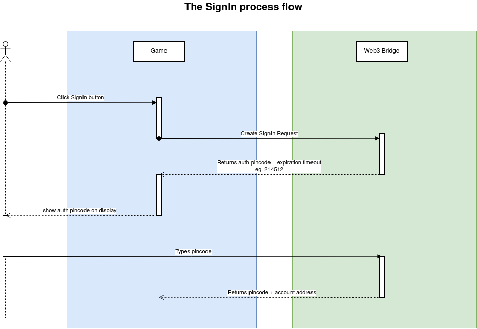

# Создание сессии юзера или процесс получения блокчейн адреса пользователя

Данный способ позволяет проводить авторизацию пользователя при каждом входе в игру.
Так же данный способ можно использовать для подключения бкокчейн адреса пользователя к игровому аккаунту.



## 1. Необходимо создать UserSession - запрос на авторизацию и отобразить полученный цифровой код из поля `code` игроку на стороне игры.

Для подтверждения создания сессии юзер должен либо перейти по sessionUrl либо вручную вбить code в личном кабинете ChainBridge

```graphql
mutation {
  addUserSession(input: {
    successRedirectUrl: "" // урл для редиректа после успешного подтверждения сессии
    failureRedirectUrl: "" // урл для зафэйлинной авторизации
    successWebhookUrl: "" // урл вебхука, будет вызван при успешной авторизации, куда будет отправлена дто сессии + юзера
    failureWebhookUrl: "" // урл вебхука для зафэйлинной авторизации
  }) {
    userSession {
      id // - ид запроса
      createdAt // - дата и время создания запроса
      expiredAt
      status // - статус сессии
        // CREATED - создан ожидает действия пользователя
        // CONFIRMED - подтвержден пользователем -> запись имеет данные о пользователе
        // CANCELED - отменен
      // Для подтверждения создания сессии юзер должен либо перейти по sessionUrl либо вручную вбить code в личном кабинете ChainBridge
      sessionUrl // ссылка куда отправить юзера для подтверждения авторизации
      code // - цифровой код, который необходимо отобразить пользователю на стороне игры
      // пользователь должен использовать данный код для подтверждения входа в игру на стороне ChainBridge
      user { // null если сессия не подтверждена юзером
        id
        address
        createdAt
        name
        profilePic
      }
    }
  }
}
```

Response example:

```json
{
  "data": {
    "addUserSession": {
      "userSession": [
        {
          "id": "4ac065b5-9449-4227-9a10-0dbda490eaa5",
          "createdAt": "2023-06-22T15:11:41.978Z",
          "expiredAt": "2023-06-22T15:41:41.978Z",
          "status": "CREATED",
          "sessionUrl": "https://chainbridge.proksy.io/sessions?id=4ac065b5-9449-4227-9a10-0dbda490eaa5",
          "code": "118148",
          "user": null
        }
      ]
    }
  }
}
```

### 1.1. Т.к. подтверждение или отмена запроса требует наличие действия пользователя, для дебага были добавлен следующий метод:

```graphql
mutation($sessionId: UUID!, $status: UserSessionStatus!) {
  debugApproveUserSessionAction(input: {
    sessionId: $sessionId // - id запроса
    status: $status // статус который хотим выставить у запроса - CONFIRMED, CANCELED
    // при выставлении статуса CONFIRMED, в поле confirmedByUserAddress будет выставлен адрес `0xc8fd80f4119dbb1e59a0ca8667447e0e36c81ea2`
  }) {
    boolean
  }
}
```

## 2. Т.к. получение адреса - процесс асинхронный. Требуется некоторое время для того чтобы юзер зашел на ChainBridge и ввел цифровой код из п.1.

Для получения обновления статуса по созданному запросу есть варианты:

### 2.1 Query: Запрос сессии раз в несколько секунд пока ее статус не изменится на CONFIRMED или CANCELED:

```graphql
query ($sessionId: UUID!) {
  userSession(where: { id: { eq: $sessionId } }) {
    id
    createdAt
    expiredAt
    status
    sessionUrl
    code
    user {
      id
      address
      createdAt
      name
      profilePic
    }
  }
}
```

### 2.2 Subscription: После создания сессии из п.1. создать подписку на UserSession с sessionId

WORK IN PROGRESS
