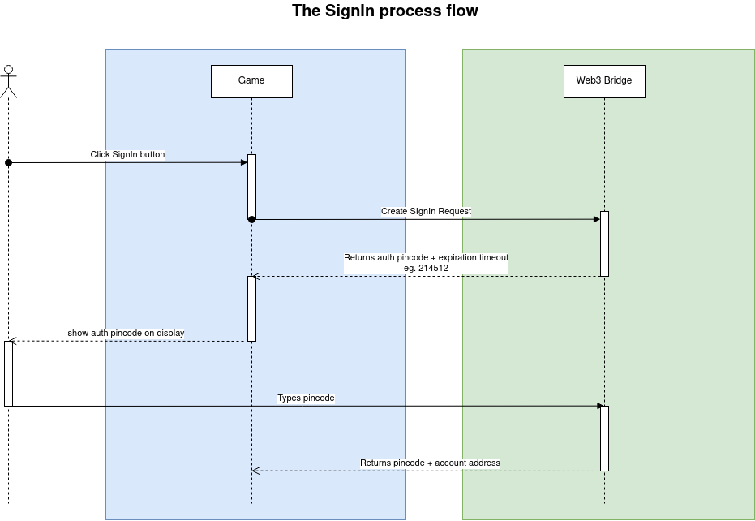

# Процесс получения блокчейн адреса пользователя

Данный способ позволяет проводить авторизацию пользователя при каждом входе в игру.
Так же данный способ можно использовать для подключения бкокчейн адреса пользователя к игровому аккаунту.



## 1. Необходимо создать SignInAction - запрос на авторизацию и отобразить полученный цифровой код из поля `code` игроку на стороне игры.

```graphql
mutation {
  addUserSignInAction {
    signInAction {
      id // - ид запроса
      createdAt // - дата и время создания запроса
      status // - статус запроса
        // CREATED - создан ожидает действия пользователя
        // CONFIRMED - подтвержден пользователем -> запись имеет данные об адресе пользователя
        // CANCELED - отменен
      expiredAt // - дата и время истечения запроса - 30 минут от даты создания запроса
      code // - цифровой код, который необходимо отобразить пользователю на стороне игры
      // пользователь должен использовать данный код для подтверждения входа в игру на стороне ChainBridge
      confirmedAt // - дата и время подтверждения запроса пользователем
      confirmedByUserId // внутренний ид пользователя в системе ChainBridge
      confirmedByUserAddress // блокчейн адрес пользователя
    }
  }
}
```

Пример запроса:

```json
{
  "data": {
    "userSignInAction": {
      "id": "254256f9-efc0-465d-9ee6-ea4739699fef",
      "createdAt": "2023-06-02T12:58:43.010Z",
      "status": "CREATED",
      "expiredAt": "2023-06-02T13:28:43.010Z",
      "code": "032833",
      "confirmedAt": null,
      "confirmedByUserId": null,
      "confirmedByUserAddress": null
    }
  }
}
```

### 1.1. Т.к. подтверждение или отмена запроса требует наличие действия пользователя, для дебага были добавлен следующий метод:

```graphql
mutation($requestId: UUID!, $status: UserActionStatus!) {
  debugApproveUserSignInAction(input: {
    requestId: $requestId // - id запроса
    status: $status // статус который хотим выставить у запроса - CONFIRMED, CANCELED
    // при выставлении статуса CONFIRMED, в поле confirmedByUserAddress будет выставлен адрес `0xc8fd80f4119dbb1e59a0ca8667447e0e36c81ea2`
  }) {
    boolean
  }
}
```

## 2. Т.к. получение адреса - процесс асинхронный. Требуется некоторое время для того чтобы юзер зашел на ChainBridge и ввел цифровой код из п.1.

Для получения обновления статуса по созданному запросу есть варианты:

### 2.1 Query: Запрос SignInAction раз в несколько секунд пока его статус не изменится на CONFIRMED или CANCELED:

```graphql
query ($id: UUID!) {
  userSignInAction(where: { id: { eq: $id } }) {
    id
    createdAt
    status
    expiredAt
    code
    confirmedAt
    confirmedByUserId
    confirmedByUserAddress
  }
}
```

### 2.2 Subscription: После создания запроса из п.1. создать подписку на SignInAction с requestId

WORK IN PROGRESS
